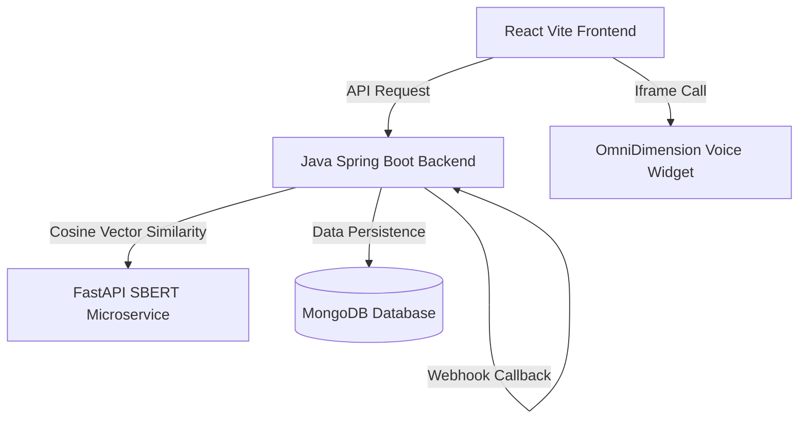

# 🎙️ InTune — AI Roommate Matching Platform

InTune is a modern co-living roommate matching application that helps users discover their most compatible flatmates. Using voice onboarding, sentence embeddings, and secure credential reveals, InTune makes finding a roommate data-driven and safe.

---

## 🏗️ System Architecture



### 💻 1. Frontend (`/frontend`)
A sleek, responsive Single Page Application built with **React**, **TypeScript**, **Tailwind CSS**, and **Shadcn UI**. Includes:
* Dynamic OmniDimension onboarding widget integrations.
* Real-time match notifications and animated card lists.
* Encrypted Chatterbox anonymous chat room, shared split expense ledger, and StyleMatch floor plan tools.

### ☕ 2. Backend (`/backend`)
A high-performance **Java Spring Boot** REST API providing authentication, data storage, and business logic:
* Secure authentication using JWT and Spring Security.
* Real-time matching controller feeding database records to the SBERT similarity engine.
* Mutual swipe matching state machines and anonymous chat messaging routing.
* Dynamic Webhook callbacks listener (`/api/webhook/omnidim`) to parse OmniDimension voice assessment transcripts.

### 🐍 3. AI Similarity Service (`/ai_service`)
A **FastAPI Python** microservice that pre-loads SBERT SentenceTransformers (`all-MiniLM-L6-v2`) to perform semantic similarity matching:
* Converts unstructured voice bio transcripts into high-dimensional vector embeddings.
* Calculates cosine similarity scores between the user profile and all verified candidate roommates.
* Scales scores into a readable $[55\%, 98\%]$ compatibility percentage.

---

## 🛠️ Tech Stack & Dependencies

* **Frontend**: React 18, TypeScript, Vite, Tailwind CSS, Lucide Icons, Radix UI.
* **Backend**: Java 17, Spring Boot 3, Spring Security, JWT, Spring Data MongoDB.
* **AI Service**: Python 3.9, FastAPI, Uvicorn, SentenceTransformers, PyTorch.
* **Database**: MongoDB Atlas.

---

## 🚀 Key Features

1. **🎙️ Voice-Based Onboarding**: Users complete their roommate profile using the voice-based OmniDimension widget. Tonal responses are transcribed and pushed asynchronously via webhook callbacks.
2. **🧠 SBERT Semantic Matching**: Offloads matching to a deep learning sentence encoder, ensuring matches are formed on actual lifestyle descriptions rather than just superficial form options.
3. **🔒 Anonymous Chatterbox**: Roommates text under aliases (e.g. `Sky_412`). Real credentials (Aadhaar name, phone, email) are only revealed when both users swipe right on each other.
4. **🛡️ Aadhaar ID OCR Verification**: Extracts Aadhaar card digits client-side using Tesseract OCR, validating the number via the **Verhoeff Checksum Algorithm** to prevent spoofing or typos.
5. **💵 Splitmate Ledger**: Shared expense split management to log, divide, and track co-living costs.

---

## 📂 Repository Structure

```text
├── ai_service/           # Python FastAPI SBERT microservice
│   ├── main.py           # Embeddings calculation API
│   └── Dockerfile        # Docker setup (downloads model weights at build time)
│
├── backend/              # Java Spring Boot API
│   ├── src/main/java/    # Security configs, controller routes, and MongoDB repositories
│   ├── pom.xml           # Maven dependencies config
│   └── Dockerfile        # Multi-stage Java compile build container
│
└── frontend/             # React + TypeScript Vite frontend SPA
    ├── src/components/   # Voice onboarding sections and widgets
    └── src/pages/        # Onboarding, Dashboard, MatchMeter, Chatterbox, Splits, StyleMatch
```

---

## 🏃 Local Run & Installation

### 1. Spring Boot Backend
Make sure local MongoDB is running (`mongodb://localhost:27017/intuneDB`):
```bash
cd backend
mvn spring-boot:run
```
*Port: `5001`*

### 2. SBERT AI Microservice
```bash
cd ai_service
python3 -m venv venv
source venv/bin/activate
pip install -r requirements.txt
python main.py
```
*Port: `8000`*

### 3. React Frontend
```bash
cd frontend
npm install
npm run dev
```
*Port: `5173`*
