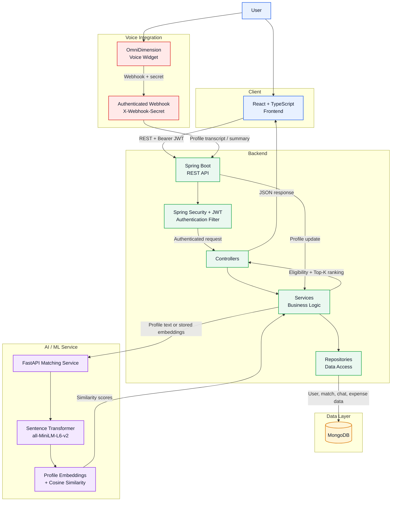

# InTune

InTune is an AI-assisted roommate matching platform that helps users discover roommates based on lifestyle compatibility, not only fixed profile filters.

Users complete a lifestyle profile by typing or voice, receive ranked recommendations, and communicate before deciding whether to form a mutual match. The application also includes document-number validation, shared expenses, and protected backend APIs.

**Live demo:** https://in-tune-phi.vercel.app/

## Problem

Traditional roommate discovery often relies on a small set of checkbox preferences. Those filters do not capture details such as sleep schedules, cleanliness, noise tolerance, study habits, or social routines. InTune lets users describe their lifestyle in natural language and uses semantic similarity to find candidates whose descriptions are more compatible.

## Solution

```text
Lifestyle profile
        ↓
Sentence Transformer embedding
        ↓
Cosine-similarity compatibility score
        ↓
Ranked Top-K candidates
        ↓
Anonymous chat, likes, mutual match, and shared expenses
```

## Key Features

- Email/password registration with BCrypt password hashing and JWT authentication
- Profile onboarding through typed text, browser speech recognition, or the OmniDimension voice widget
- Browser-side OCR with Tesseract.js plus backend Verhoeff checksum validation for submitted 12-digit document numbers
- AI-assisted roommate matching with stored embeddings, cosine similarity, Top-K ranking, and a Jaccard fallback
- Anonymous-first candidate discovery and chat, with identity details returned for confirmed matches
- Mutual like/match flow backed by MongoDB match state
- Shared expense creation and history restricted to confirmed roommate matches
- Protected webhook processing for OmniDimension profile updates
- Backend request validation, configurable CORS, and rate limiting for candidate and chat endpoints

## Architecture



The frontend communicates with Spring Boot through REST requests. Spring Security validates the JWT and places the authenticated user in the security context. Controllers handle HTTP concerns, services contain focused business rules, repositories access MongoDB, and `AiSimilarityClient` calls the Python service.

## How Matching Works

The matching model is `sentence-transformers/all-MiniLM-L6-v2`, which produces 384-dimensional text embeddings.

1. A user submits or updates lifestyle text.
2. Spring Boot asks FastAPI to generate an embedding.
3. The embedding and model name are stored in the user’s MongoDB document.
4. During candidate retrieval, stored embeddings are sent to FastAPI for cosine-similarity comparison.
5. Candidates are filtered to verified users and the current user is excluded.
6. Spring Boot sorts the results by score and returns the configured Top-K value, which defaults to 10.

If an embedding is missing, stale, or the AI service is unavailable, the backend uses the text-based matching path where possible and ultimately falls back to Jaccard word-overlap similarity. Calls to FastAPI have configured connection and read timeouts so a dependent service cannot block a request indefinitely.

The project compares the eligible candidate set in memory; it does not use a vector database or ANN index.

## Authentication and Security

The implemented authentication flow is:

```text
Email/password
      ↓
BCrypt password verification
      ↓
JWT generation
      ↓
Authorization: Bearer <token>
      ↓
Spring Security JWT filter
```

Important protections include:

- Passwords are stored using BCrypt hashes rather than plaintext.
- JWT signing requires a configured `JWT_SECRET` of at least 32 bytes.
- Request DTOs validate required fields, email, password length, IDs, and maximum text lengths.
- Sensitive user responses use `SafeUserResponse` rather than exposing the complete persistence object.
- Chat access is checked on the backend, and expense access requires a confirmed mutual match.
- The OmniDimension webhook requires `X-Webhook-Secret`; webhook payloads are validated before profile updates.
- CORS origins are supplied through `CORS_ALLOWED_ORIGINS` rather than allowing every origin.
- Candidate and chat operations have authenticated in-memory rate limits.

The document flow validates formatting and the Verhoeff checksum; it is not government-backed identity verification or full KYC.

## Technology Stack

| Area | Technologies |
| --- | --- |
| Frontend | React 18, TypeScript, Vite, Tailwind CSS, shadcn/ui, React Router |
| Backend | Java 17, Spring Boot 3.3, Spring Security, Spring Data MongoDB, REST APIs |
| Authentication | JWT with JJWT, BCrypt |
| Database | MongoDB |
| AI service | Python, FastAPI, Sentence Transformers, PyTorch |
| Matching | `all-MiniLM-L6-v2`, embeddings, cosine similarity, Jaccard fallback |
| Browser verification | Tesseract.js and Verhoeff checksum logic |
| Deployment support | Vercel SPA configuration and Dockerfiles for Spring Boot and FastAPI |

## Design Decisions

- **Sentence Transformers:** lifestyle matching needs semantic similarity, so equivalent ideas can be considered related even when users use different words.
- **Stored embeddings:** embeddings are regenerated when profile text changes and reused during matching instead of being generated unnecessarily for every recommendation request.
- **Separate FastAPI service:** Python keeps the ML dependencies and model runtime separate from Spring Boot’s core application and security logic.
- **MongoDB:** the application stores user documents, match state, messages, expenses, and variable-length embedding arrays in document-shaped records.

## Engineering Challenges

- **Avoiding repeated model work:** profile embeddings are refreshed when lifestyle text changes, while matching reuses compatible stored vectors. Users with older or missing embeddings still have a text-based fallback path.
- **Dependent-service failure:** Spring Boot communicates with FastAPI using bounded timeouts and treats invalid or failed AI responses as unavailable, allowing fallback matching to continue.
- **Moving trust to the backend:** verification state, chat authorization, and expense authorization are decided by backend code rather than by frontend state or client-provided user identity.

## Local Setup

Requirements: Java 17, Maven, Node.js, Python, and MongoDB.

```bash
git clone https://github.com/suhanigupta23/InTune.git
cd InTune
```

### Backend

```bash
cd backend
export JWT_SECRET="<at-least-32-byte-secret>"
export MONGO_URI="mongodb://localhost:27017/intuneDB"
export CORS_ALLOWED_ORIGINS="http://localhost:5173"
export WEBHOOK_SECRET="<webhook-secret-if-voice-webhook-is-used>"
mvn spring-boot:run
```

The backend defaults to port `5001`; configure `AI_SIMILARITY_URL` for a different FastAPI deployment.

### AI service

```bash
cd ../ai_service
python3 -m venv venv
source venv/bin/activate
pip install -r requirements.txt
python main.py
```

FastAPI defaults to port `8000` and exposes embedding and similarity endpoints under `/api`.

### Frontend

```bash
cd ../frontend
npm install
npm run dev
```

Set `VITE_API_BASE_URL` to the Spring Boot API URL. If the OmniDimension widget is used, configure its public widget key through `VITE_OMNIDIMENSION_WIDGET_KEY`. Frontend `VITE_*` values are bundled into browser code and must not contain private server secrets.

## Limitations and Future Work

- Candidate comparison is currently performed over the eligible candidate set; vector indexing or ANN retrieval could help at much larger scale.
- Rate limiting is process-local; a distributed deployment could use shared storage such as Redis.
- Chat uses polling rather than WebSockets.
- Matching quality does not yet have a dedicated evaluation dataset or offline quality metrics.
- Embedding generation is synchronous during profile updates; background jobs could be useful for larger workloads.
- Stronger session management, such as refresh-token rotation, and a real OAuth/OIDC provider could be added if required.

## Project Summary

InTune combines a React frontend, Spring Boot/MongoDB backend, and FastAPI Sentence Transformer service to match roommates from lifestyle text. The project also demonstrates JWT security, backend validation and authorization, stored embeddings, graceful AI fallback, anonymous chat, mutual matching, and shared expense tracking.

## Author

Suhani Gupta — [GitHub](https://github.com/suhanigupta23) · [LinkedIn](https://linkedin.com/in/suhani-gupta23/) · [Portfolio](https://suhani-gupta.vercel.app)
